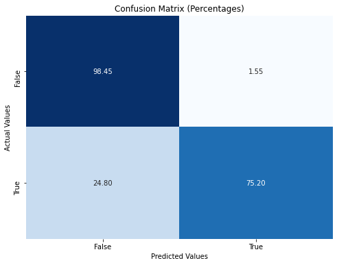
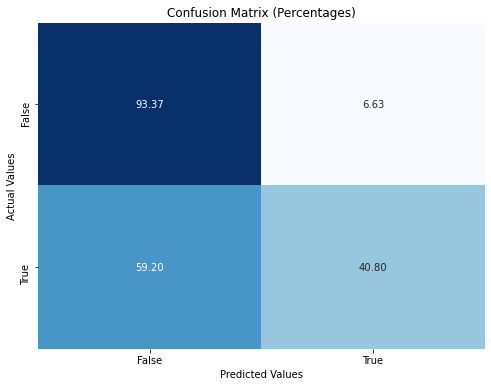

# Customer-Retention-Classification Project

This is a standard classification project. In this notebook, I will create binary classification models to predict wether or not a telephone service customer churned. Churn refers to customers who have canceled their subscriptions. I will focus on 2 different models-Decision Tree Classifier and Logistic Regression. A baseline of each model will be created and then iteratively improved upon until the best model is created.  

## Business Understanding

We have a dataset of 3333 customer records.  Each record contains features of each customer that will be the independent or X variables.  The Churn column is our dependent or Y variable.  In this case a false value in the churn column is a customer who maintains their subscription and a true value is someone who cancels their subscription.  **Being able to correctly predict the true and false values of Churn will let the business team better predict budget, revenue, and market strategies.**

This Project utilizes the following dataset:

* [Telecom Dataset](https://www.kaggle.com/datasets/becksddf/churn-in-telecoms-dataset)

## Initial EDA
This dataset doesn't need any cleaning, but it's always good practice to remove whitespaces and look at unique values for each column.  This will help us establish which features are continous and which are categorical.  We have the following columns:

*  state                   
*  account_length          
*  area_code                
*  phone_number            
*  international_plan       
*  voice_mail_plan          
*  number_vmail_messages     
*  total_day_minutes       
*  total_day_calls           
*  total_day_charge        
*  total_eve_minutes       
*  total_eve_calls           
*  total_eve_charge        
*  total_night_minutes     
*  total_night_calls         
*  total_night_charge      
*  total_intl_minutes      
*  total_intl_calls          
*  total_intl_charge       
*  customer_service_calls    
*  churn  

After inspecting the values, we can tell the State, Area_Code, Phone_Number, International_Plan, Voice_Mail_Plan, and Churn are categorical  Also, Phone_Number and Area_code will have no predictive value and are subsequently dropped.  There is also a direct 1:1 correlation between minutes and charge for each time of day, so the minutes columns can all be dropped.  It is important to drop unnecesary columns to reduce runtime on our models down the road.  The State column seems like it could be important, but it is not usable as is.  One-Hot-Encoding must be used so that our models can be built properly.  Then our X variables and Y variables are determined (Y is Churn and X is everything else) and we build our Test and Train sets.  Now we can begin model building and data analysis.  '

## Modeling Process

2 Models are built and then iteratively improved upon.  First, a Decision Tree Classifier is built and then a Logistic Regression model is built.  The following methods are used to improve the model:

* Feature Scaling
  *Setting all values of continous variables between -1 and 1 and reducing extreme values.
* SMOTE
  *An oversampling technique that creates artificial rows of the minority class to balance a dataset.  This will actually skew our True Positives in this case.
* Pruning
  *This is used for the Decision Tree Classifier to remove any nodes that do not contribute to our model
* Hyper Parameter Tuning
  *Finetuning hyperparameters can improve most of the deficiencies of our model.

## Evaluation Methods

Here are the following evaluation metrics used and what they mean:

* Accuracy-How often the models predictions are correct.  However, it can be misleading when datasets are imbalanced.  The number of correct predictoins divided by the total number of predictions.
* False Class Precision
* True Class Precision
* False Class Recall
* True Class Recall
* Cross Validation-A technique for assessing how the results of an analysis will generalize to an independent data set.  The dataset is randomly divided into subsets and then each subset is modeled.
* AUC-this is a graphical represenation (also on a score from 0-1) of the trade-off TPR (True Positive Rate or Recall) and FPR (False Positive Rate) that provides an aggregate measure of performance across all classificatoin thresholds.

## Conclusions

Our Best Model is the Feature Scaled, Finetuned Decision Tree.  This produced the following results:

  
We can See our Decision Tree Classifer very accurately predicts True Negatives (expected as dataset has mostly negatives) and True Positives.
  
Our Logistic Regression Model can very accurately predict True Positives.  More work can be done to improve the Prediction rate for True Negatives.

## Limitations
* Our dataset was fairly small.  It would be interesting as well to see what types of phones each person owned.  I would assume someone with a newer phone may be more prepared to pay for a more expensive plan.  
There are more models that can be used and more improvements to be made using more sophisticated techniques that we will learn more about and can apply to the next project.

## Next Steps.
* Review or market trends in cell phone plans
* Compare international movies for worldwide success.

## Recommendations  
Here is a quick view of our Feature Importances graph.    
  

  
We can glean the following information from this graph and some solutions to retain them as customers.  Customers who churned had:  
* High bills
  *  Offer discounts to longtime customers
* To make more customer service calls
  *  Improve Customer Service training
* International plans
  *  Offer international discounts

## Repository Structure

- Repository/
  - .ipynb_checkpoints/
    - Classification_Notebook-checkpoint.ipynb
    - Final_Notebook-checkpoint.ipynb
    - Model Building Exploration-checkpoint.ipynb
  - Data/
    - telecom.csv
  - PDF/
    - .gitignore
  - README.md
  - Final_Notebook.ipynb
  - Model_building_Exploration.ipynb

## Author
By: Will Byrd
Email: byrdwcrawford@gmail.com
Linkedin: https://www.linkedin.com/in/will-byrd-40323863/
Wordpress: blog33497.wordpress.com

